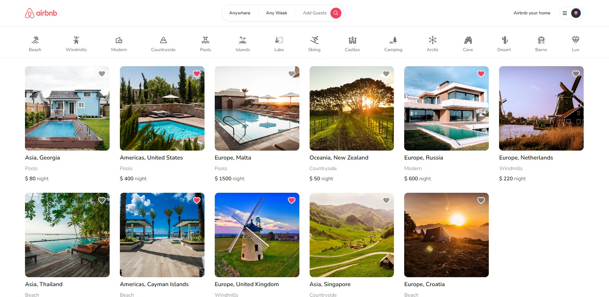
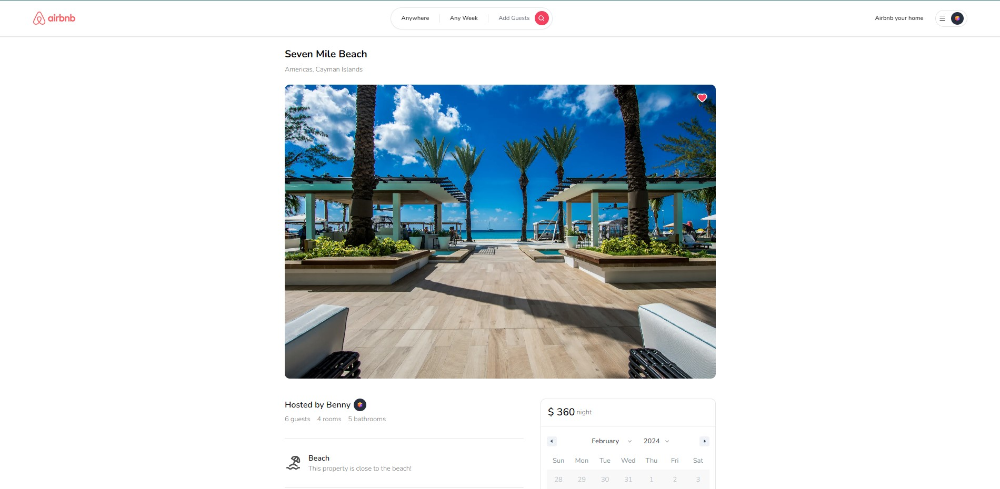
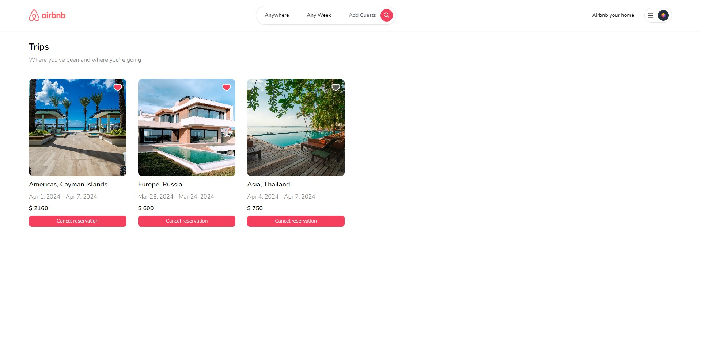
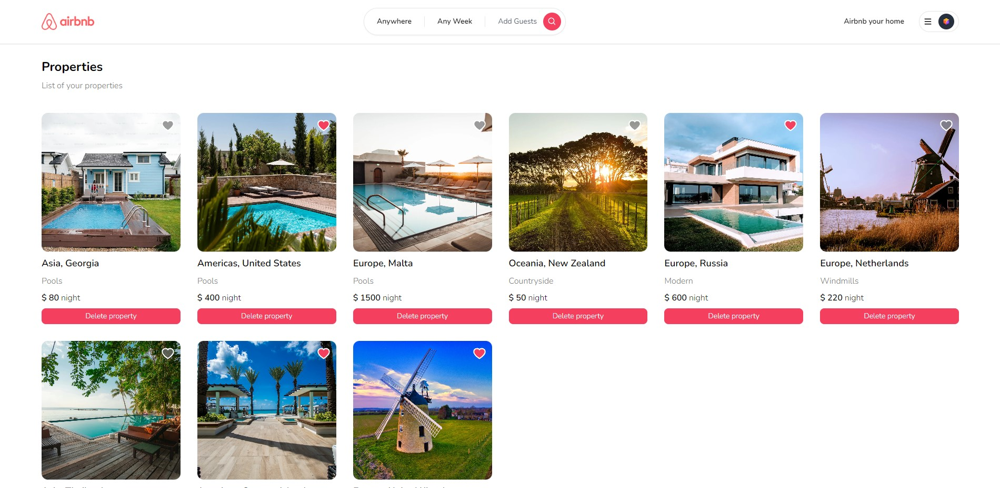

## Airbnb Clone
This is a project made with NextJS 13, React, TailwindCSS, MongoDB. It is a replica of airbnb's website, but not fully as all features are not present. Cloudinary CDN is used for image upload and displaying images, it also includes google and github login.
Demo: https://benny-airbnb.vercel.app/

## Screenshots
<table>
  <tr>
    <td></td>
    <td></td>
  </tr>
  <tr>
    <td></td>
    <td></td>
  </tr>
</table>
